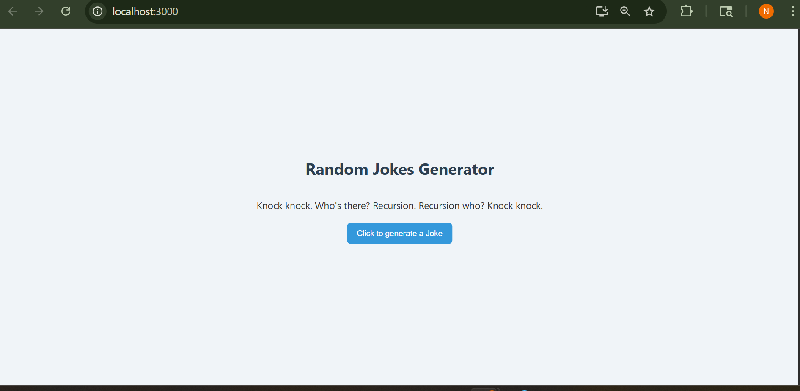

# Random Jokes Generator (React)

This is a simple and fun React app that fetches random **programming jokes** from the JokeAPI and displays them on the screen. A great beginner project for learning about API integration, React components, and state management using `useState`.

---

## Features

- One-click to fetch a random programming joke
- Uses React functional components with props
- API integration using `fetch()`
- Simple, clean UI with centered layout

---

## Technologies Used

- React (`useState`, props)
- JavaScript `fetch()`
- JokeAPI ([https://sv443.net/jokeapi/v2/](https://sv443.net/jokeapi/v2/))

---

## 📸 Screenshot

 
> _Joke displayed with a styled button to fetch new jokes_

